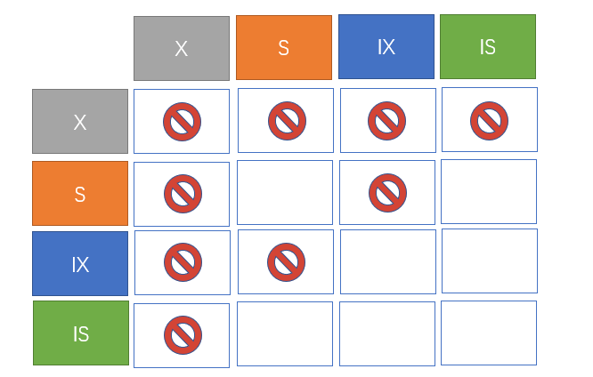

# 锁粒度
Mysql 提供了两种封锁粒度：行级锁跟表级锁。

使用锁的时候，我们都需要关注到锁的资源，锁定的数据量越少，系统能支持的并发成都就更好。
因为加锁需要消耗资源，包括锁的各种操作（获取锁、释放锁、检查锁状态等）。

所以在锁的粒度选择上，需要再锁开销跟并发程度之间做一个权衡。

# 锁类型
## 读写锁
- 互斥锁（Exclusive），也就是我们常说的写锁，简写为X锁。
- 共享锁（Shared），也称读锁，简写为S锁。
有以下规定：
- 一个事务对数据对象被加了X锁，就可以对A进行读取跟更新。加锁期间其他事务不能对A加任何锁。
- 一个事务对数据对象被加了S锁，可以对A进行读取操作，但不能进行更新。加锁期间其他事务能对相同数据对象加S锁，但不能加X锁。

## 意向锁
### 为什么要有意向锁
意向锁（Intention Locks）可以更容易支持多粒度封锁。

如果只有行级锁跟表级锁，某一个事务想要对表加X锁，则需要检测该表是否被其他事务加了表锁跟行锁，那么就需要对该表的每一行都检测。

意向锁则是在原来读写锁的基础上引入的。简写为IX跟IS，他们都是表锁。
有以下规定：
- 一个事务在获得某个数据行对象的 S 锁之前，必须先获得表的 IS 锁或者更强的锁；
- 一个事务在获得某个数据行对象的 X 锁之前，必须先获得表的 IX 锁。

有了意向锁，上面的情况下，某一个事务想要对表加X锁，则需要检测是否有其他事务对表A加了X/IX/S/IS锁，如果有，则表示有其他事务正在对这个表有表锁跟行锁的行为，故该事务会想对该表加X锁，会阻塞。
各种锁的兼容情况：
- 

- 任意 IS/IX 锁之间都是兼容的，因为它们只表示想要对表加锁，而不是真正加锁；
- 这里兼容关系针对的是表级锁，而表级的 IX 锁和行级的 X 锁兼容，两个事务可以对两个数据行加 X 锁。

# 锁协议
## 三级封锁协议
在运用X锁和S锁对数据对象加锁时，还需要约定一些规则 ，例如何时申请X锁或S锁、持锁时间、何时释放等。称这些规则为封锁协议（Locking Protocol）。对封锁方式规定不同的规则，就形成了各种不同的封锁协议。
### 一级封锁协议
- 事务T在修改数据R之前必须先对其加X锁，直到事务结束才释放。事务结束包括正常结束（COMMIT）和非正常结束（ROLLBACK）。
- 可以解决丢失修改问题，因为不能同时有两个事务对同一个数据进行修改，那么事务的修改就不会被覆盖。
### 二级封锁协议
- 在一级封锁协议的基础上，加上事务T在读取数据A之前必须先对其加S锁，读完后方可释放S锁。
- 可以解决读脏数据问题，因为如果一个事务在对数据 A 进行修改，根据 1 级封锁协议，会加 X 锁，那么就不能再加 S 锁了，也就是不会读入数据。
### 三级封锁协议
- 在二级的基础上，要求读取数据 A 时必须加 S 锁，直到事务结束了才能释放 S 锁。
- 可以解决不可重复读的问题，因为读 A 时，其它事务不能对 A 加 X 锁，从而避免了在读的期间数据发生改变。

## 两段锁协议
两段锁协议是指每个事务的执行可以分为两个阶段：生长阶段（加锁阶段）和衰退阶段（解锁阶段）。
- 加锁阶段：在该阶段可以进行加锁操作。在对任何数据进行读操作之前要申请并获得S锁，在进行写操作之前要申请并获得X锁。加锁不成功，则事务进入等待状态，直到加锁成功才继续执行。
- 解锁阶段：当事务释放了一个封锁以后，事务进入解锁阶段，在该阶段只能进行解锁操作不能再进行加锁操作。
事务遵循两段锁协议是保证可串行化调度的充分条件。例如以下操作满足两段锁协议，它是可串行化调度。
- 
- 两段锁协议并不要求事务必须一次将所有要使用的数据全部加锁，因此遵守两段锁协议的事务可能发生死锁。
# 显示锁跟隐式锁
## 显示锁
```
SELECT ... LOCK IN SHARE MODE;
SELECT ... FOR UPDATE;
```
## 隐式锁
隐式锁是InnoDB实现的一种延迟加锁机制，其特点是只有在可能发生冲突时才加锁，从而减少了锁的数量，提高了系统整体性能。
比如我们的insert、update在遇到冲突的时候，则会加上X锁。
# 隔离级别
## 未提交读（READ UNCOMMITTED）
事务中的修改，即使没有提交，对其它事务也是可见的。
## 提交读（READ COMMITTED）
一个事务只能读取已经提交的事务所做的修改。换句话说，一个事务所做的修改在提交之前对其它事务是不可见的。
## 可重复读（REPEATABLE READ）
保证在同一个事务中多次读取同一数据的结果是一样的。
## 可串行化（SERIALIZABLE）
强制事务串行执行，这样多个事务互不干扰，不会出现并发一致性问题。
该隔离级别需要加锁实现，因为要使用加锁机制保证同一时间只有一个事务执行，也就是保证事务串行执行。

- 注意：虽然mysql默认的隔离级别为RR，但是多数情况下，都会选择用RC。除非极少数场景下，业务都可以接受幻读，而在RR隔离级别下，容易导致死锁等问题。
# 多版本并发控制（MVCC）
mysql的大多数事务型存储引擎实现的都不是简单的行级锁。基于提升并发性能的考虑，它们一般都同时实现了多版本并发控制。
可以认为MVCC是行级锁的一种变种，但是它很多情况下避免了加锁操作，因为开销更低。
InnoDB的MVCC，是通过在每行记录最后保存的两个隐藏的列来实现，这两个列，一个保存了行的创建时间，一个保存行的过期时间（或删除时间），当然存储的并不是实际的时间值，而是系统版本好。每开始一个新的事务，系统版本号都会自动递增。事务开始时刻的系统版本号会作为事务的版本号，用来查询到的每行版本号进行比较。
REPEATABLE READ隔离级别下，MVCC的实现：
- SELECT
  - InnoDB之查找版本早于当前事务版本号的数据行，这样可以确保事务读取的行，要么是在事务开始前已经存在，要么是事务自身插入或者修改过的。
  - 行的删除版本要么未定义，要么大于当前事务版本号，这可以确保事务读取到的行在事务开始之前未被删除。
- INSERT
  - InnoDB为新插入的每一行保存当前系统版本号作为行版本号。
- DELETE
  - InnoDB为删除的每一行保存当前系统版本号作为行删除标识。
- UPDATE
  - InnoDB为插入一行新记录，保存当前系统版本号作为行版本号，同时保存当前系统版本号到原来的行作为行删除版本号。 MVCC只在REPEATABLE READ跟READ COMMITED两个隔离级别工作。其他两个隔离级别都和MVCC不兼容。因为READ UNCOMMITED总是读取最新的数据行，而不是符合当前事务版本的数据行。而SERIALIZABLE则会对所有读取的数据的行都加锁。
# Next-key locks
MVCC 不能解决幻影读问题，Next-Key Locks 就是为了解决这个问题而存在的。在可重复读（REPEATABLE READ）隔离级别下，使用 MVCC + Next-Key Locks 可以解决幻读问题。
## Record Locks
锁定一个记录上的索引，而不是记录本身。
如果表没有设置索引，InnoDB 会自动在主键上创建隐藏的聚簇索引，因此 Record Locks 依然可以使用。
## Gap Locks
锁定索引之间的间隙，但是不包含索引本身。例如当一个事务执行以下语句，其它事务就不能在 t.c 中插入 15。

```SELECT c FROM t WHERE c BETWEEN 10 and 20 FOR UPDATE;```

## Next-Key Locks
它是 Record Locks 和 Gap Locks 的结合，不仅锁定一个记录上的索引，也锁定索引之间的间隙。它锁定一个前开后闭区间，例如一个索引包含以下值：10, 11, 13, and 20，那么就需要锁定以下区间：
```
(-∞, 10]
(10, 11]
(11, 13]
(13, 20]
(20, +∞)
```
# 插入意向锁
插入意向锁（insert intention lock）
- 插入意向锁是一种间隙锁形式的意向锁，在真正执行 INSERT 操作之前设置。
- 当执行插入操作时，总会检查当前插入操作的下一条记录（已存在的主索引节点）上是否存在锁对象，判断是否锁住了 gap，如果锁住了，则判定和插入意向锁冲突，当前插入操作就需要等待，也就是配合上面的间隙锁或者临键锁一起防止了幻读操作。
- 因为插入意向锁是一种意向锁，意向锁只是表示一种意向，所以插入意向锁之间不会互相冲突，多个插入操作同时插入同一个 gap 时，无需互相等待，比如当前索引上有记录 4 和 8，两个并发 session 同时插入记录 6，7。他们会分别为(4,8)加上 GAP 锁，但相互之间并不冲突。
- INSERT 语句在执行插入之前，会先在 gap 中加入插入意向锁，如果是唯一索引，还会进行 Duplicate Key 判断，如果存在相同 Key 且该 Key 被加了互斥锁，则还会加共享锁，然后等待（因为这个相同的 Key 之后有可能会回滚删除，这里非常容易死锁）。等到成功插入后，会在这条记录上加排他记录锁。
## 插入意向锁跟间隙锁
- 可以把插入意向锁理解为一种特殊的gap锁，但其跟gap锁冲突。即尽管「插入意向锁」也属于间隙锁，但两个事务却不能在同一时间内，一个拥有间隙锁，另一个拥有该间隙区间内的插入意向锁（当然，插入意向锁如果不在间隙锁区间内则是可以的）。所以，插入意向锁和间隙锁之间是冲突的。
- 间隙锁之间是不冲突的。
- 一个插入意向锁跟间隙锁冲突导致的死锁case：（推荐看，很清晰的例子）
  - https://www.xiaolincoding.com/mysql/lock/show_lock.html#time-3-%E9%98%B6%E6%AE%B5%E5%8A%A0%E9%94%81%E5%88%86%E6%9E%90