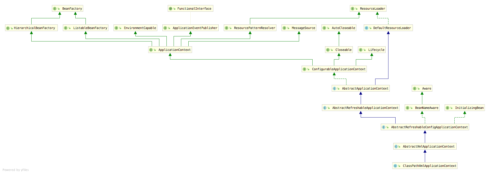
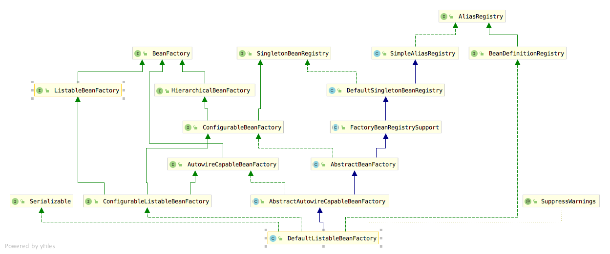

##  ClassPathXmlApplicationContext

####  ClassPathXmlApplicationContext类图


先来看下spring最常使用的一个类、包括其方法
```java
class ClassPathXmlApplicationContext{
    private Resource[] configResources;

    public ClassPathXmlApplicationContext(String... congfigLocations) throws BeansException{
        this(new String[]{configLocations},ture,null);
    }

    public ClassPathXmlApplicationContext(String[] configLocations,boolean refresh,ApplicationContext parant){

        super(parant);

        setConfigLocations(configLocations);

        if(refresh){
            refresh();
        }
    }

}
    
```

### setConfigLocations

- 创建环境对象ConfigurableEnvironment和处理ClassPathXmlApplicationContext传入的字符串的占位符

```java
public void setConfigLocations(@Nullable String... locations) {
		if (locations != null) {
			Assert.noNullElements(locations, "Config locations must not be null");
			this.configLocations = new String[locations.length];
			for (int i = 0; i < locations.length; i++) {
				this.configLocations[i] = resolvePath(locations[i]).trim();
			}
		}
		else {
			this.configLocations = null;
		}
}

protected String resolvePath(String path) {
		return getEnvironment().resolveRequiredPlaceholders(path);
}


```

####  getEnvironment

Environment对象表示整个应用运行时环境。

- [Spring Environment抽象](https://www.cnblogs.com/liuenyuan1996/p/11133984.html)](https://www.cnblogs.com/liuenyuan1996/p/11133984.html)
- 主要作用：
  - 设置spring的环境，常用的profile
  - 设置系统资源 property

```java
public ConfigurableEnvironment getEnvironment() {
		if (this.environment == null) {
			this.environment = createEnvironment();
		}
		return this.environment;
}
```

#### resolveRequiredPlaceholders

```java
public String resolveRequiredPlaceholders(String text) throws IllegalArgumentException {
        return this.propertyResolver.resolveRequiredPlaceholders(text);
}

public String resolveRequiredPlaceholders(String text) throws IllegalArgumentException {
    if (this.strictHelper == null) {
      //创建一个占位符解析器
      /**
      PropertyPlaceholderHelper
      将字符串里面的占位符内容，用我们配置的properties里的替换，这是一个单纯的类，没有继承没有实现，也没依赖spring框架
      **/
      this.strictHelper = this.createPlaceholderHelper(false);
    }

    return this.doResolvePlaceholders(text, this.strictHelper);
}

private String doResolvePlaceholders(String text, PropertyPlaceholderHelper helper) {
  	return helper.replacePlaceholders(text, this::getPropertyAsRawString);
}

public String replacePlaceholders(String value, 
                     PropertyPlaceholderHelper.PlaceholderResolver placeholderResolver) {
        Assert.notNull(value, "'value' must not be null");
        return this.parseStringValue(value, placeholderResolver, new HashSet());
}	

//parseStringValue  最后到这个方法

/**
PropertyPlaceholderHelper占位解析的主要入口，其大致的过程是将占位符的内容一块一块地取下来，通过递归将最内层的占位符先替换掉，然后跳出替换外面的占位符。

这个方法主要就是处理所有使用${}方式的占位符
**/
	protected String parseStringValue(
         String value, PlaceholderResolver placeholderResolver, Set<String> visitedPlaceholders) {

      StringBuilder result = new StringBuilder(value);
      int startIndex = value.indexOf(this.placeholderPrefix);
      while (startIndex != -1) {
         int endIndex = findPlaceholderEndIndex(result, startIndex);
         if (endIndex != -1) {
            String placeholder = result.substring(startIndex + this.placeholderPrefix.length(), endIndex);
            String originalPlaceholder = placeholder;
            if (!visitedPlaceholders.add(originalPlaceholder)) {
               throw new IllegalArgumentException(
                     "Circular placeholder reference '" + originalPlaceholder + "' in property definitions");
            }
            placeholder = parseStringValue(placeholder, placeholderResolver, visitedPlaceholders);
            // Now obtain the value for the fully resolved key...
            String propVal = placeholderResolver.resolvePlaceholder(placeholder);
            if (propVal == null && this.valueSeparator != null) {
               int separatorIndex = placeholder.indexOf(this.valueSeparator);
               if (separatorIndex != -1) {
                  String actualPlaceholder = placeholder.substring(0, separatorIndex);
                  String defaultValue = placeholder.substring(separatorIndex + this.valueSeparator.length());
                  propVal = placeholderResolver.resolvePlaceholder(actualPlaceholder);
                  if (propVal == null) {
                     propVal = defaultValue;
                  }
               }
            }
            if (propVal != null) {
               // Recursive invocation, parsing placeholders contained in the
               // previously resolved placeholder value.
               propVal = parseStringValue(propVal, placeholderResolver, visitedPlaceholders);
               result.replace(startIndex, endIndex + this.placeholderSuffix.length(), propVal);
               if (logger.isTraceEnabled()) {
                  logger.trace("Resolved placeholder '" + placeholder + "'");
               }
               startIndex = result.indexOf(this.placeholderPrefix, startIndex + propVal.length());
            }
            else if (this.ignoreUnresolvablePlaceholders) {
               // Proceed with unprocessed value.
               startIndex = result.indexOf(this.placeholderPrefix, endIndex + this.placeholderSuffix.length());
            }
            else {
               throw new IllegalArgumentException("Could not resolve placeholder '" +
                     placeholder + "'" + " in value \"" + value + "\"");
            }
            visitedPlaceholders.remove(originalPlaceholder);
         }
         else {
            startIndex = -1;
         }
      }

      return result.toString();
   }
```


###  refresh

配置文件名称解析完毕后，就到了最关键的一步refresh方法，这个方法涵盖了spring初始化的一切。

```java
public void refresh() throws BeansException,IllegalStateException{
  synchronized(this.startShutdownMonitor){
   	//准备资源，验证必须属性
    prepareRefresh();
    
    //创建一个configurableListableBeanFactory作为基本的IOC容器，下面的操作都是给予这个BeanFactory操作的。
    //这里的BeanFactory已经把xml中定义的BeanDefinition加载入IOC容器内了。
    ConfigurableListableBeanFactory beanFactory = obtainFreshBeanFactory();
    
    //设置BeanFactory的基本属性
    prepareBeanFactory(beanFactory);
    
    try{
      //通知子类来配置beanFactory，一个扩展点
      //如果有Bean实现了BeanFactoryPostProcessor接口，那么容器初始化以后，Spring会负责调用里面的postProcessorBeanFactory方法。
      postProcessBeanFactory(beanFactory);
      
      //调用BeanFactoryPostProcessor各个实现类的postProcessBeanFactory(factory) 方法
      invokeBeanFactoryPostProcessor(beanFactory);
      
      //注册BeanPostProcessors
      //此接口有两个方法，postProcessBeforeInitialization和postProcessAfterInitialization分别会在bean初始化之前和初始化之后得到执行
      registerBeanPostProcessors(beanFacotry);
      
      //初始化messageSource  提供国际化的消息访问
      initMessageSource();
      
      //初始化 时间分发器
      initApplicationEventMulticaster();
      
      //通知子类刷新容器
      //扩展点
      onRefresh();
      
      //注册事件监听器
      registerListeners();
      
      //初始化所有没有这只懒加载的singletonBean
      finishBeanFactoryInitialzation(beanFactory);
      
      //收尾
      finishRefresh();
    }catch(BeansException e){
      if (logger.isWarnEnabled()) {
					logger.warn("Exception encountered during context initialization - " +
							"cancelling refresh attempt: " + ex);
				}

				// 销毁bean
				destroyBeans();

				// 重置 'active' 标志.
				cancelRefresh(ex);

				throw ex;
    }
  }
}

```

#### prepareRefresh

- 记录容器的启动时间，标记‘已启动‘状态，检查环境变量等

```java
protected void prepareRefresh() {
		this.startupDate = System.currentTimeMillis();
		this.closed.set(false);
		this.active.set(true);

		if (logger.isDebugEnabled()) {
			if (logger.isTraceEnabled()) {
				logger.trace("Refreshing " + this);
			}
			else {
				logger.debug("Refreshing " + getDisplayName());
			}
		}

		// Initialize any placeholder property sources in the context environment
    // 初始化加载配置文件方法，并没有具体实现，一个留给用户的扩展点
		initPropertySources();

		// Validate that all properties marked as required are resolvable
		// see ConfigurablePropertyResolver#setRequiredProperties
  	//验证所有标记为必须的属性，此处没有进行任何必须的配置，所以验证通过
		getEnvironment().validateRequiredProperties();

		// Allow for the collection of early ApplicationEvents,
		// to be published once the multicaster is available...
		this.earlyApplicationEvents = new LinkedHashSet<>();
	}

```


#### obtainFreshBeanFactory

- beanFactory的初始化
- Bean的加载和注册等事件

```java
protected ConfigurableListableBeanFactory obtainFreshBeanFactory() {
		refreshBeanFactory();
		return getBeanFactory();
}


protected final void refreshBeanFactory() throws BeansException {
  	//判断当前的applicationContext是否存在BeanFactory，如果存在就销毁所有的Bean，关闭BeanFactory
  	
  //TODO 这里有点疑问
  // 注意，一个应用可以存在多个BeanFactory，这里判断的是当前ApplicationContext是否存在BeanFactory
	
		if (hasBeanFactory()) {
			destroyBeans();
			closeBeanFactory();
		}
		try {
      //初始化DefaultListableBeanFactory
			DefaultListableBeanFactory beanFactory = createBeanFactory();
			beanFactory.setSerializationId(getId());
      
      //设置BeanFactory的两个配置属性，是否允许Bean覆盖，是否允许循环引用
			customizeBeanFactory(beanFactory);
      
      //加载Bean到BeanFactory中
			loadBeanDefinitions(beanFactory);
			synchronized (this.beanFactoryMonitor) {
				this.beanFactory = beanFactory;
			}
		}
		catch (IOException ex) {
			throw new ApplicationContextException("I/O error parsing bean definition source for " + getDisplayName(), ex);
		}
	}
```

#### 看一下DefaultListableBeanFactory类图



- 注：
  - BeanFactory是一个Bean容器，而BeanDefinition就是Bean的一种形式，它包含了Bean所指向的类，是否单例，是否懒加载，依赖关系的属性。
  - BeanFactory中保存的就是BeanDifinition。


#### loanBeanDefinitions

- 这里是一个委派模式，在当前类之定义了抽象的loanBeanDifinitions方法，具体的实现由子类实现
- 我们这里 AbstractXmlApplicationContext的实现


```java
protected void loadBeanDefinitions(DefaultListableBeanFactory beanFactory) throws BeansException, IOException {
		// Create a new XmlBeanDefinitionReader for the given BeanFactory.
		XmlBeanDefinitionReader beanDefinitionReader = new XmlBeanDefinitionReader(beanFactory);

		// Configure the bean definition reader with this context's
		// resource loading environment.
		beanDefinitionReader.setEnvironment(this.getEnvironment());
		beanDefinitionReader.setResourceLoader(this);
		beanDefinitionReader.setEntityResolver(new ResourceEntityResolver(this));

		// Allow a subclass to provide custom initialization of the reader,
		// then proceed with actually loading the bean definitions.
  	// 初始化BeanDefinitionReader
		initBeanDefinitionReader(beanDefinitionReader);
  	
		loadBeanDefinitions(beanDefinitionReader);
	}


protected void loadBeanDefinitions(XmlBeanDefinitionReader reader) throws BeansException, IOException {
  	//Resource对象及配置文件
		Resource[] configResources = getConfigResources();
		if (configResources != null) {
			reader.loadBeanDefinitions(configResources);
		}
  
  	//这里的location最后也转换为上面的Resource对象，添加进上面的Resource[]
  	// 看下面的LoanBeanDefinitions
		String[] configLocations = getConfigLocations();
		if (configLocations != null) {
			reader.loadBeanDefinitions(configLocations);
		}
	}

//如果没有指定的configLocations,则用系统默认的ConfigLocation，这里configLocation是setConfigLocations方法时就赋值的
protected String[] getConfigLocations() {
		return (this.configLocations != null ? this.configLocations : getDefaultConfigLocations());
}


```


#### loanBeanDefinitions

```java
public int loadBeanDefinitions(Resource... resources) throws BeanDefinitionStoreException {
		Assert.notNull(resources, "Resource array must not be null");
		int count = 0;
		for (Resource resource : resources) {
			count += loadBeanDefinitions(resource);
		}
  	//返回加载的所有BeanDifinition的数量
		return count;
}

//接待看下面
public int loadBeanDefinitions(String... locations) throws BeanDefinitionStoreException {
		Assert.notNull(locations, "Location array must not be null");
		int count = 0;
		for (String location : locations) {
			count += loadBeanDefinitions(location);
		}
		return count;
}

//接待看下面
public int loadBeanDefinitions(String location) throws BeanDefinitionStoreException {
		return loadBeanDefinitions(location, null);
	}

//最后到这里
public int loadBeanDefinitions(String location, @Nullable Set<Resource> actualResources) throws BeanDefinitionStoreException {
		ResourceLoader resourceLoader = getResourceLoader();
		if (resourceLoader == null) {
			throw new BeanDefinitionStoreException(
					"Cannot load bean definitions from location [" + location + "]: no ResourceLoader available");
		}

		if (resourceLoader instanceof ResourcePatternResolver) {
			// Resource pattern matching available.
			try {
        //通过location将配置文件转换成Resource对象
				Resource[] resources = ((ResourcePatternResolver) resourceLoader).getResources(location);
        //回到了上面的方法
				int count = loadBeanDefinitions(resources);
				if (actualResources != null) {
          //添加给Resources[] 中
					Collections.addAll(actualResources, resources);
				}
				if (logger.isTraceEnabled()) {
					logger.trace("Loaded " + count + " bean definitions from location pattern [" + location + "]");
				}
				return count;
			}
			catch (IOException ex) {
				throw new BeanDefinitionStoreException(
						"Could not resolve bean definition resource pattern [" + location + "]", ex);
			}
		}
		else {
			// Can only load single resources by absolute URL.
			Resource resource = resourceLoader.getResource(location);
			int count = loadBeanDefinitions(resource);
			if (actualResources != null) {
				actualResources.add(resource);
			}
			if (logger.isTraceEnabled()) {
				logger.trace("Loaded " + count + " bean definitions from location [" + location + "]");
			}
			return count;
		}
	}
```


#### loadBeanDefinitions(Resource resource)

接着看这个方法究竟做了啥

- 因为我们的配置文件是xml，所以loadBeanDefinitions这个最终会走到xmlBeanDefinitionReader，如果使用java类配置或者Groovy的话就是另外两个类。

```java
	public int loadBeanDefinitions(Resource resource) throws BeanDefinitionStoreException {
		return loadBeanDefinitions(new EncodedResource(resource));
	}

	public int loadBeanDefinitions(EncodedResource encodedResource) throws BeanDefinitionStoreException {
		Assert.notNull(encodedResource, "EncodedResource must not be null");
		if (logger.isTraceEnabled()) {
			logger.trace("Loading XML bean definitions from " + encodedResource);
		}

		Set<EncodedResource> currentResources = this.resourcesCurrentlyBeingLoaded.get();
		if (currentResources == null) {
			currentResources = new HashSet<>(4);
			this.resourcesCurrentlyBeingLoaded.set(currentResources);
		}
		if (!currentResources.add(encodedResource)) {
			throw new BeanDefinitionStoreException(
					"Detected cyclic loading of " + encodedResource + " - check your import definitions!");
		}
		try {
      //获取到文件流
			InputStream inputStream = encodedResource.getResource().getInputStream();
			try {
				InputSource inputSource = new InputSource(inputStream);
				if (encodedResource.getEncoding() != null) {
					inputSource.setEncoding(encodedResource.getEncoding());
				}
        //进行加载
				return doLoadBeanDefinitions(inputSource, encodedResource.getResource());
			}
			finally {
				inputStream.close();
			}
		}
		catch (IOException ex) {
			throw new BeanDefinitionStoreException(
					"IOException parsing XML document from " + encodedResource.getResource(), ex);
		}
		finally {
			currentResources.remove(encodedResource);
			if (currentResources.isEmpty()) {
				this.resourcesCurrentlyBeingLoaded.remove();
			}
		}
	}
```


#### doLoadBeanDefinitions

```java
protected int doLoadBeanDefinitions(InputSource inputSource, Resource resource)
			throws BeanDefinitionStoreException {

		try {
      //文件转换  将xml文件转换成Document对象
			Document doc = doLoadDocument(inputSource, resource);
      //根据Document对象注册Bean  真相快到了
			int count = registerBeanDefinitions(doc, resource);
			if (logger.isDebugEnabled()) {
				logger.debug("Loaded " + count + " bean definitions from " + resource);
			}
			return count;
		}
		catch (BeanDefinitionStoreException ex) {
			throw ex;
		}
		catch (SAXParseException ex) {
			throw new XmlBeanDefinitionStoreException(resource.getDescription(),
					"Line " + ex.getLineNumber() + " in XML document from " + resource + " is invalid", ex);
		}
		catch (SAXException ex) {
			throw new XmlBeanDefinitionStoreException(resource.getDescription(),
					"XML document from " + resource + " is invalid", ex);
		}
		catch (ParserConfigurationException ex) {
			throw new BeanDefinitionStoreException(resource.getDescription(),
					"Parser configuration exception parsing XML from " + resource, ex);
		}
		catch (IOException ex) {
			throw new BeanDefinitionStoreException(resource.getDescription(),
					"IOException parsing XML document from " + resource, ex);
		}
		catch (Throwable ex) {
			throw new BeanDefinitionStoreException(resource.getDescription(),
					"Unexpected exception parsing XML document from " + resource, ex);
		}
	}
```


#### registerBeanDefinitions

```java
	public int registerBeanDefinitions(Document doc, Resource resource) throws BeanDefinitionStoreException {
    //构建读取Document的工具类
		BeanDefinitionDocumentReader documentReader = createBeanDefinitionDocumentReader();
    //获取已注册的Bean数量
		int countBefore = getRegistry().getBeanDefinitionCount();
    //进行注册
		documentReader.registerBeanDefinitions(doc, createReaderContext(resource));
    
    //总数量  -  之前注册的bean数量
		return getRegistry().getBeanDefinitionCount() - countBefore;
	}


	public void registerBeanDefinitions(Document doc, XmlReaderContext readerContext) {
		this.readerContext = readerContext;
    //这里doc.getDocumentElement()是获取Document对象的跟节点  Element对象
		doRegisterBeanDefinitions(doc.getDocumentElement());
	}


	protected void doRegisterBeanDefinitions(Element root) {
		// Any nested <beans> elements will cause recursion in this method. In
		// order to propagate and preserve <beans> default-* attributes correctly,
		// keep track of the current (parent) delegate, which may be null. Create
		// the new (child) delegate with a reference to the parent for fallback purposes,
		// then ultimately reset this.delegate back to its original (parent) reference.
		// this behavior emulates a stack of delegates without actually necessitating one.
    
    //BeanDefinitionParseDelegate的作用是用来根据解析文件的结果来生成Bean的实例
		BeanDefinitionParserDelegate parent = this.delegate;
		this.delegate = createDelegate(getReaderContext(), root, parent);

		if (this.delegate.isDefaultNamespace(root)) {
      //获取<beans ... profile="***" /> 中的profile参数与当前环境是否匹配 
      // 如果不匹配则不进行解析
			String profileSpec = root.getAttribute(PROFILE_ATTRIBUTE);
			if (StringUtils.hasText(profileSpec)) {
				String[] specifiedProfiles = StringUtils.tokenizeToStringArray(
						profileSpec, BeanDefinitionParserDelegate.MULTI_VALUE_ATTRIBUTE_DELIMITERS);
				// We cannot use Profiles.of(...) since profile expressions are not supported
				// in XML config. See SPR-12458 for details.
				if (!getReaderContext().getEnvironment().acceptsProfiles(specifiedProfiles)) {
					if (logger.isDebugEnabled()) {
						logger.debug("Skipped XML bean definition file due to specified profiles [" + profileSpec +
								"] not matching: " + getReaderContext().getResource());
					}
					return;
				}
			}
		}
		
    //前置扩展点
		preProcessXml(root);
   	
    //继续解析
		parseBeanDefinitions(root, this.delegate);
    
    //后置扩展点
		postProcessXml(root);

		this.delegate = parent;
	}
```

- preProcessXml跟postProcessXml是留给实现DefaultBeanDefinitionDocumentReader方法后自定义实现的。
- 接着往下看parseBeanDefinitions


####parseBeanDefinitions

```java
protected void parseBeanDefinitions(Element root, BeanDefinitionParserDelegate delegate) {
	//default namespace 涉及到四个标签 <import />  <alias /> <bean /> <beans> 四个标签	
  if (delegate.isDefaultNamespace(root)) {
			NodeList nl = root.getChildNodes();
			for (int i = 0; i < nl.getLength(); i++) {
				Node node = nl.item(i);
				if (node instanceof Element) {
					Element ele = (Element) node;
					if (delegate.isDefaultNamespace(ele)) {
						parseDefaultElement(ele, delegate);
					}
					else {
						delegate.parseCustomElement(ele);
					}
				}
			}
		}
  	// 解析其他 namespace 的元素
		else {
			delegate.parseCustomElement(root);
		}
	}

	
	//default标签处理
	private void parseDefaultElement(Element ele, BeanDefinitionParserDelegate delegate) {
		//import标签
    if (delegate.nodeNameEquals(ele, IMPORT_ELEMENT)) {
			importBeanDefinitionResource(ele);
		}
    //alias标签
		else if (delegate.nodeNameEquals(ele, ALIAS_ELEMENT)) {
			processAliasRegistration(ele);
		}
    //bean标签
		else if (delegate.nodeNameEquals(ele, BEAN_ELEMENT)) {
			processBeanDefinition(ele, delegate);
		}
    //beans标签
		else if (delegate.nodeNameEquals(ele, NESTED_BEANS_ELEMENT)) {
			// recurse
			doRegisterBeanDefinitions(ele);
		}
	}


//看一下bean标签处理
	protected void processBeanDefinition(Element ele, BeanDefinitionParserDelegate delegate) {
		
    //分析各个属性并转化为bean实例
    BeanDefinitionHolder bdHolder = delegate.parseBeanDefinitionElement(ele);
		if (bdHolder != null) {
			bdHolder = delegate.decorateBeanDefinitionIfRequired(ele, bdHolder);
			try {
				// Register the final decorated instance.
        // 注册bean实例
				BeanDefinitionReaderUtils.registerBeanDefinition(bdHolder, getReaderContext().getRegistry());
			}
			catch (BeanDefinitionStoreException ex) {
				getReaderContext().error("Failed to register bean definition with name '" +
						bdHolder.getBeanName() + "'", ele, ex);
			}
			// Send registration event.
			getReaderContext().fireComponentRegistered(new BeanComponentDefinition(bdHolder));
		}
	}
```


先来看一下parseBeanDefinitionElement

#### parseBeanDefinitionElement 

- BeanDefinitionHolder简单来说就是一个BeanDefinition的持有者

```java
public class BeanDefinitionHolder implements BeanMetadataElement {

	private final BeanDefinition beanDefinition;

	private final String beanName;

	@Nullable
	private final String[] aliases;
 
  ...
}
```


```java
	public BeanDefinitionHolder parseBeanDefinitionElement(Element ele) {
		return parseBeanDefinitionElement(ele, null);
	}

	public BeanDefinitionHolder parseBeanDefinitionElement(Element ele, @Nullable BeanDefinition containingBean) {
    //获取bean id
		String id = ele.getAttribute(ID_ATTRIBUTE);
    
    //获取bean name
		String nameAttr = ele.getAttribute(NAME_ATTRIBUTE);
		
    //别名
		List<String> aliases = new ArrayList<>();
    
    //将 name 属性的定义按照 “逗号、分号、空格” 切分，形成一个 别名列表数组，

		if (StringUtils.hasLength(nameAttr)) {
			String[] nameArr = StringUtils.tokenizeToStringArray(nameAttr, MULTI_VALUE_ATTRIBUTE_DELIMITERS);
			aliases.addAll(Arrays.asList(nameArr));
		}
		
    //如果没有指定id，那么用别名列表的第一个名字作为beanName
		String beanName = id;
		if (!StringUtils.hasText(beanName) && !aliases.isEmpty()) {
			beanName = aliases.remove(0);
			if (logger.isTraceEnabled()) {
				logger.trace("No XML 'id' specified - using '" + beanName +
						"' as bean name and " + aliases + " as aliases");
			}
		}

		if (containingBean == null) {
			checkNameUniqueness(beanName, aliases, ele);
		}
		
    //根据<bean ...></bean>中的配置创建BeanDefinition,然后把配置中的信息都设置到实例中
    //parseBeanDefinitionElement这里就创建了一个BeanDefinition
		AbstractBeanDefinition beanDefinition = parseBeanDefinitionElement(ele, beanName, containingBean);
		if (beanDefinition != null) {
      //如果没有id和name，那么此时的beanName会为null
			if (!StringUtils.hasText(beanName)) {
				try {
					if (containingBean != null) {
						beanName = BeanDefinitionReaderUtils.generateBeanName(
								beanDefinition, this.readerContext.getRegistry(), true);
					}
					else {
						beanName = this.readerContext.generateBeanName(beanDefinition);
						// Register an alias for the plain bean class name, if still possible,
						// if the generator returned the class name plus a suffix.
						// This is expected for Spring 1.2/2.0 backwards compatibility.
						String beanClassName = beanDefinition.getBeanClassName();
						if (beanClassName != null &&
								beanName.startsWith(beanClassName) && beanName.length() > beanClassName.length() &&
								!this.readerContext.getRegistry().isBeanNameInUse(beanClassName)) {
              
              //把BeanClassName设置为bean的别名
							aliases.add(beanClassName);
						}
					}
					if (logger.isTraceEnabled()) {
						logger.trace("Neither XML 'id' nor 'name' specified - " +
								"using generated bean name [" + beanName + "]");
					}
				}
				catch (Exception ex) {
					error(ex.getMessage(), ele);
					return null;
				}
			}
			String[] aliasesArray = StringUtils.toStringArray(aliases);
      
      //返回生成的一个beanDefinitionHolder对象
			return new BeanDefinitionHolder(beanDefinition, beanName, aliasesArray);
		}

		return null;
	}
```


再看下parseBeanDefinitionElement方法

#### parseBeanDefinitionElement

```

```

```java
public AbstractBeanDefinition parseBeanDefinitionElement(
      Element ele, String beanName, @Nullable BeanDefinition containingBean) {

   this.parseState.push(new BeanEntry(beanName));

   String className = null;
   if (ele.hasAttribute(CLASS_ATTRIBUTE)) {
      className = ele.getAttribute(CLASS_ATTRIBUTE).trim();
   }
   String parent = null;
   if (ele.hasAttribute(PARENT_ATTRIBUTE)) {
      parent = ele.getAttribute(PARENT_ATTRIBUTE);
   }

   try {
     
      // 创建 BeanDefinition，然后设置类信息
      AbstractBeanDefinition bd = createBeanDefinition(className, parent);
		
  	  // 设置 BeanDefinition 的一堆属性，这些属性定义在 AbstractBeanDefinition 中
      parseBeanDefinitionAttributes(ele, beanName, containingBean, bd);
      bd.setDescription(DomUtils.getChildElementValueByTagName(ele, DESCRIPTION_ELEMENT));
			
     /**
       * 下面的一堆是解析 <bean>......</bean> 内部的子元素，
       * 解析出来以后的信息都放到 bd 的属性中
       */
      parseMetaElements(ele, bd);
      parseLookupOverrideSubElements(ele, bd.getMethodOverrides());
      parseReplacedMethodSubElements(ele, bd.getMethodOverrides());
			
      // 解析 <constructor-arg />
      parseConstructorArgElements(ele, bd);
     
      // 解析 <property />
      parsePropertyElements(ele, bd);
     
      // 解析 <qualifier />
      parseQualifierElements(ele, bd);

      bd.setResource(this.readerContext.getResource());
      bd.setSource(extractSource(ele));

      return bd;
   }
   catch (ClassNotFoundException ex) {
      error("Bean class [" + className + "] not found", ele, ex);
   }
   catch (NoClassDefFoundError err) {
      error("Class that bean class [" + className + "] depends on not found", ele, err);
   }
   catch (Throwable ex) {
      error("Unexpected failure during bean definition parsing", ele, ex);
   }
   finally {
      this.parseState.pop();
   }

   return null;
}
```

 

到这里一个BeanDefinition对象就出来了。


我们接下来回到Bean的注册


#### registerBeanDefinition

```java
	public static void registerBeanDefinition(
			BeanDefinitionHolder definitionHolder, BeanDefinitionRegistry registry)
			throws BeanDefinitionStoreException {

		// Register bean definition under primary name.
    //注册这个bean
		String beanName = definitionHolder.getBeanName();
		registry.registerBeanDefinition(beanName, definitionHolder.getBeanDefinition());

		// Register aliases for bean name, if any.
    //如果有别名的话，全都注册一遍
		String[] aliases = definitionHolder.getAliases();
		if (aliases != null) {
			for (String alias : aliases) {
				registry.registerAlias(beanName, alias);
			}
		}
	}


	//注册
	public void registerBeanDefinition(String beanName, BeanDefinition beanDefinition)
			throws BeanDefinitionStoreException {

		Assert.hasText(beanName, "Bean name must not be empty");
		Assert.notNull(beanDefinition, "BeanDefinition must not be null");

		if (beanDefinition instanceof AbstractBeanDefinition) {
			try {
				((AbstractBeanDefinition) beanDefinition).validate();
			}
			catch (BeanDefinitionValidationException ex) {
				throw new BeanDefinitionStoreException(beanDefinition.getResourceDescription(), beanName,
						"Validation of bean definition failed", ex);
			}
		}
		
    //这个beanDefinitionMap存放所有注册过的BeanDefinition
    //判断是否注册过
		BeanDefinition existingDefinition = this.beanDefinitionMap.get(beanName);
    
    //有重复名字的Bean
		if (existingDefinition != null) {
      //不允许覆盖，报错
			if (!isAllowBeanDefinitionOverriding()) {
				throw new BeanDefinitionOverrideException(beanName, beanDefinition, existingDefinition);
			}
			else if (existingDefinition.getRole() < beanDefinition.getRole()) {
				// e.g. was ROLE_APPLICATION, now overriding with ROLE_SUPPORT or ROLE_INFRASTRUCTURE
				if (logger.isInfoEnabled()) {
					logger.info("Overriding user-defined bean definition for bean '" + beanName +
							"' with a framework-generated bean definition: replacing [" +
							existingDefinition + "] with [" + beanDefinition + "]");
				}
			}
			else if (!beanDefinition.equals(existingDefinition)) {
				if (logger.isDebugEnabled()) {
					logger.debug("Overriding bean definition for bean '" + beanName +
							"' with a different definition: replacing [" + existingDefinition +
							"] with [" + beanDefinition + "]");
				}
			}
			else {
				if (logger.isTraceEnabled()) {
					logger.trace("Overriding bean definition for bean '" + beanName +
							"' with an equivalent definition: replacing [" + existingDefinition +
							"] with [" + beanDefinition + "]");
				}
			}
      //覆盖
			this.beanDefinitionMap.put(beanName, beanDefinition);
		}
		else 
      //判断是否已经有其他的Bean开始初始化
      //注册bean时，bean还没初始化，在spring容器启动完毕之后，才会预初始化所有的singleton beans
			if (hasBeanCreationStarted()) {
				// Cannot modify startup-time collection elements anymore (for stable iteration)
				synchronized (this.beanDefinitionMap) {
					this.beanDefinitionMap.put(beanName, beanDefinition);
          
          //TODO 这里不是很理解
					List<String> updatedDefinitions = new ArrayList<>(this.beanDefinitionNames.size() + 1);
					updatedDefinitions.addAll(this.beanDefinitionNames);
					updatedDefinitions.add(beanName);
					this.beanDefinitionNames = updatedDefinitions;
          
          //手动注册的singleton bean
					if (this.manualSingletonNames.contains(beanName)) {
						Set<String> updatedSingletons = new LinkedHashSet<>(this.manualSingletonNames);
						updatedSingletons.remove(beanName);
						this.manualSingletonNames = updatedSingletons;
					}
				}
			}
			else {
				// Still in startup registration phase
        // 将 BeanDefinition 放到这个 map 中，这个 map 保存了所有的 BeanDefinition
				this.beanDefinitionMap.put(beanName, beanDefinition);
        
        // 这是个 ArrayList，所以会按照 bean 配置的顺序保存每一个注册的 Bean 的名字
				this.beanDefinitionNames.add(beanName);
        
        // 这是个 LinkedHashSet，代表的是手动注册的 singleton bean，
				this.manualSingletonNames.remove(beanName);
			}
			this.frozenBeanDefinitionNames = null;
		}

		if (existingDefinition != null || containsSingleton(beanName)) {
			resetBeanDefinition(beanName);
		}
	}
```


到这里已经初始化了Bean容器，`<bean/>`的配置也相应的转换成一个个BeanDefinition，然后注册了所有的BeanDefinition到beanDefinitionMap;


# 遗留问题

- applicationContext跟beanFacotry的关系和区别
- 一个applicationContext是否可以有多个BeanFactory，如何实现
-  DefaultListableBeanFactory 这个类的继承图.   这里得补上
- <beans ... profile="***" />   profile详解再研究一下
- 手动注册bean的几种方式
- Bean如何初始化
- 整理一个流程图


# 参考

- [Spring源码解析系列汇总](http://www.spring4all.com/article/16302)