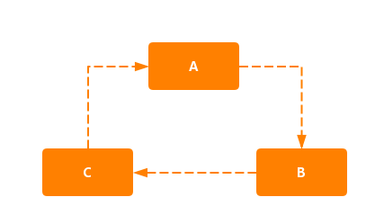

# Spring的三级缓存以及循环依赖问题
## 循环依赖
循环依赖就是循环引用，即有两个或者两个以上的bean互相持有对方，最终形成闭环。
- 

Spring中的循环依赖场景有：
- 构造器的循环依赖
- field属性的循环依赖

对于构造器的循环依赖，Spring是无法解决的，只能抛出循环依赖异常。


而对于field属性的循环依赖，Spring只解决了scope为singleton的循环依赖，对于scooe为prototype的bean，Spring无法解决。

而Spring正是适用三级缓存解决解决循环依赖问题。

## 三级缓存

这里涉及到三个对象，极为三个缓存。
```java
//DefaultSingletonBeanRegistry

	/** Cache of singleton objects: bean name to bean instance. */
    //单例对象的cache（一级）
	private final Map<String, Object> singletonObjects = new ConcurrentHashMap<>(256);

	/** Cache of singleton factories: bean name to ObjectFactory. */
    //单例对象工厂的cache（三级）
	private final Map<String, ObjectFactory<?>> singletonFactories = new HashMap<>(16);

	/** Cache of early singleton objects: bean name to bean instance. */
    //提前曝光的单例对象的cache（二级）
	private final Map<String, Object> earlySingletonObjects = new HashMap<>(16);
```

首先，在加载bean的时候，在doGetBean()中，首先会根据beanName从单例bean缓存中获取，如果不为空则返回。
```java
protected Object getSingleton(String beanName, boolean allowEarlyReference) {
        // 从一级缓存中 获取
		Object singletonObject = this.singletonObjects.get(beanName);
        //如果 为空，并且该beanName指定的bean正常创建
		if (singletonObject == null && isSingletonCurrentlyInCreation(beanName)) {
			synchronized (this.singletonObjects) {
                // 从提前曝光的缓存（二级缓存）中获取
				singletonObject = this.earlySingletonObjects.get(beanName);
				if (singletonObject == null && allowEarlyReference) {
                    // 从三级缓存中获取
					ObjectFactory<?> singletonFactory = this.singletonFactories.get(beanName);
					if (singletonFactory != null) {
                        // 实例对象
						singletonObject = singletonFactory.getObject();
                        // 添加到二级缓存
						this.earlySingletonObjects.put(beanName, singletonObject);
                        // 删除三级缓存
						this.singletonFactories.remove(beanName);
					}
				}
			}
		}
		return singletonObject;
	}
```
这里是缓存的获取，在doCreateBean()方法中会**创建完bean但是还进行属性填充**会将其添加进缓存。
这里就是三级缓存解决循环依赖的关键，这个时候bean已经被创建，但是还未对其进行属性填充，但是对于依赖它的对象而言已经足够（可以根据对象引用定位到堆中对象）
```java
    //单例，允许提前提前曝光bean beanName指定的bean正常创建中
    boolean earlySingletonExposure = (mbd.isSingleton() && this.allowCircularReferences &&
				isSingletonCurrentlyInCreation(beanName));
    if (earlySingletonExposure) {
        if (logger.isTraceEnabled()) {
            logger.trace("Eagerly caching bean '" + beanName +
                    "' to allow for resolving potential circular references");
        }
        //添加进三级缓存
        addSingletonFactory(beanName, () -> getEarlyBeanReference(beanName, mbd, bean));
    }

    protected void addSingletonFactory(String beanName, ObjectFactory<?> singletonFactory) {
		Assert.notNull(singletonFactory, "Singleton factory must not be null");
		synchronized (this.singletonObjects) {
			if (!this.singletonObjects.containsKey(beanName)) {
				this.singletonFactories.put(beanName, singletonFactory);
				this.earlySingletonObjects.remove(beanName);
				this.registeredSingletons.add(beanName);
			}
		}
	}
```

而在doGetBean方法中
```java
// Create bean instance.
    if (mbd.isSingleton()) {
        sharedInstance = getSingleton(beanName, () -> {
            try {
                // 创建bean
                return createBean(beanName, mbd, args);
            }
            catch (BeansException ex) {
                // Explicitly remove instance from singleton cache: It might have been put there
                // eagerly by the creation process, to allow for circular reference resolution.
                // Also remove any beans that received a temporary reference to the bean.
                destroySingleton(beanName);
                throw ex;
            }
        });
        bean = getObjectForBeanInstance(sharedInstance, name, beanName, mbd);
    }	
    

    public Object getSingleton(String beanName, ObjectFactory<?> singletonFactory) {
		Assert.notNull(beanName, "Bean name must not be null");
		synchronized (this.singletonObjects) {
            // 从一级缓存中获取
			Object singletonObject = this.singletonObjects.get(beanName);
			if (singletonObject == null) {
				if (this.singletonsCurrentlyInDestruction) {
					throw new BeanCreationNotAllowedException(beanName,
							"Singleton bean creation not allowed while singletons of this factory are in destruction " +
							"(Do not request a bean from a BeanFactory in a destroy method implementation!)");
				}
				if (logger.isDebugEnabled()) {
					logger.debug("Creating shared instance of singleton bean '" + beanName + "'");
				}
				beforeSingletonCreation(beanName);
				boolean newSingleton = false;
				boolean recordSuppressedExceptions = (this.suppressedExceptions == null);
				if (recordSuppressedExceptions) {
					this.suppressedExceptions = new LinkedHashSet<>();
				}
				try {
                    // 从入参进来的singletonFactory 对象（即三级缓存对象）中获取
					singletonObject = singletonFactory.getObject();
					newSingleton = true;
				}
				catch (IllegalStateException ex) {
					// Has the singleton object implicitly appeared in the meantime ->
					// if yes, proceed with it since the exception indicates that state.
					singletonObject = this.singletonObjects.get(beanName);
					if (singletonObject == null) {
						throw ex;
					}
				}
				catch (BeanCreationException ex) {
					if (recordSuppressedExceptions) {
						for (Exception suppressedException : this.suppressedExceptions) {
							ex.addRelatedCause(suppressedException);
						}
					}
					throw ex;
				}
				finally {
					if (recordSuppressedExceptions) {
						this.suppressedExceptions = null;
					}
					afterSingletonCreation(beanName);
				}
				if (newSingleton) {
                    // 添加到一级缓存对象中
					addSingleton(beanName, singletonObject);
				}
			}
			return singletonObject;
		}
	}


    // 添加进一级缓存，同时删除二级、三级缓存
    protected void addSingleton(String beanName, Object singletonObject) {
		synchronized (this.singletonObjects) {
			this.singletonObjects.put(beanName, singletonObject);
			this.singletonFactories.remove(beanName);
			this.earlySingletonObjects.remove(beanName);
			this.registeredSingletons.add(beanName);
		}
	}
```

通过以上，可以看出Spring在创建Bean的时候并没有等它全部创建完毕，而是在创建过程中将bean的ObjectFactory对象提前曝光，这样一旦其他bean在创建的时候需要依赖该bean，就可以使用ObjectFactory的getObject获取了。


接下来思考：
## 为什么要使用三级缓存
### 假如不适用二级缓存，即使用三级缓存中的一级跟三级
假如A 依赖于B跟C，B跟C同时又依赖A。
那么在创建A的时候，实例化之后提前把ObjectFactory对象暴露出去，调用getBean(b)时，b实例化，提前把ObjectFactory暴露到三级缓存，再调用getBean(a)依赖注入a实例，由于提前暴露了三级缓存，可以从三级缓存中获取a实例，b完成了依赖注入，升级为一级缓存，a再实例化c，c在进行跟b一样的操作，到了getBean(a)从三级缓存中得到a实例，但是从三级缓存ObjectFactory.getObject()方法获取的对象会不一致。

# 参考
- [https://www.cnblogs.com/java-chen-hao/p/11139887.html](https://www.cnblogs.com/java-chen-hao/p/11139887.html)
